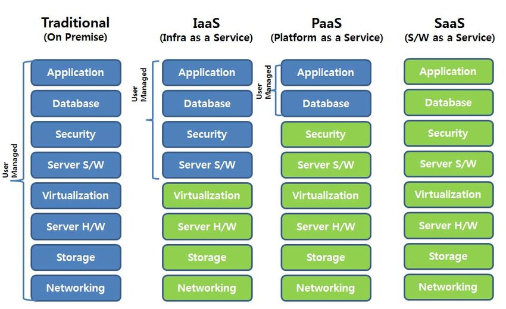

# Cloud Computing | Computação em Nuvem

### Infrastructure as a Service (IaaS)

- **Definição**: Infraestrutura como Serviço (IaaS), é um modelo de serviço de computação em nuvem, usado para fornecer recursos de computação, armazenamento, rede, entre outros. `Assim podemos focar apenas no provisionamento/pernozalização desses recursos, e não precisamos nos preocupar com a manutenção dos mesmos, assim focando em outros pontos, como na imagem acima`.

- **Características**
    - Flexibilidade para escalar e economizar recursos de TI `verticalmente` conformte a demanda.
    - Migração de infraestrutura com mais agilidade, uma vez que o seus recursos estão catalogados e mensurados para determinada aplicação.
    - Levantamento de necessidades acelerado, uma vez que podemos mensurar a necessida durante a demanda e escalar no mesmo momento.

- **Vantagens**
    - Velocidade
    - Desempenho
    - Confiabilidade
    - Backup e recuperação
    - Economia

- **Custo**
    - IaaS é um modelo de computação no qual os clientes pagam apenas pelos recursos que são usados.

### Plataform as a Service (PaaS)

- **Definição**: Plataforma como Serviço (PaaS), é um modelo de serviço de computação em nuvem, onde fornecemos tudo o que os desenvolvedores vão precisar para poderem desenvolver, implantar, executar e gerenciar suas aplicações. Sem que os mesmos precisem se preocupar com SO (Sitema operacional) e suas atualizações, ferramentas de desenvolvimento ou manter hardware.

- **Características**
    - Evita as dificuldades e custos de instalações de hardware e software.
    - As equipes compram o acesso ou são cobrados por utilização, a todos os recursos necessários para o desenvolvimento.

- **Vantagens**
    - Velocidade no tempo de lançamento (`Time to Market`)
    - Manutenção reduzida
    - Escalabilidade
    - Segurança compartilhada

### Software as a Service (SaaS)

## Referências
- IaaS
    - https://www.oracle.com/br/cloud/what-is-iaas/#:~:text=Infraestrutura%20como%20servi%C3%A7o%20(IaaS)%20%C3%A9,nuvem%20privada%20ou%20nuvem%20h%C3%ADbrida.
    - https://azure.microsoft.com/pt-br/resources/cloud-computing-dictionary/what-is-iaas
    - https://aws.amazon.com/pt/what-is/iaas/
- PaaS
    - https://cloud.google.com/learn/what-is-paas?hl=pt-br
