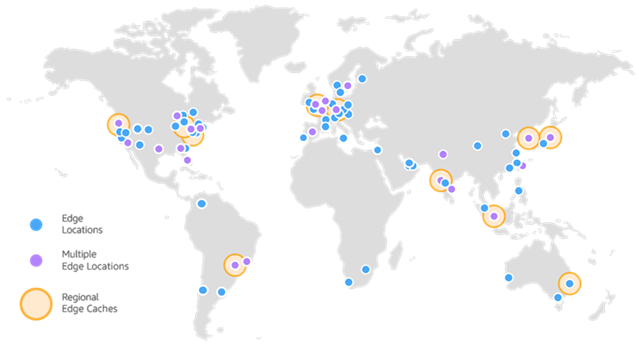

# AWS Global Infrastructure

Para entendermos a estrutura global da AWS, temos que entender algumas divisões.

- AWS Regions (Regiões)
- AWS Availability Zones (Zonas de Disponibilidade)
- AWS Edge Locations (Pontos de presença)
- AWS Global services

## AWS Regions

- **O que é?** O conceito de região vem pela associação de um local físico onde os datacenters lógicos estão agrupados. Cada região é composta de pelo menos `3 AZs`, que ficam isoladas uma das outras. `A maioria dos serviços da AWS tem escopo regional.`

- [Serviços por região](https://aws.amazon.com/about-aws/global-infrastructure/regional-product-services/?nc1=h_ls)

## AWS Availability Zones

- **O que é?** As zonas de disponibilidade (`AZ`), são um ou mais datacenters, com redundância em sua energia, rede e conectividade entre as outras AZs.

- Elas ficam separadas em um raio de 100 Km entre si, tendo um conexão física, para proporsionar alta disponibilidade, prevensão de desastres naturais. 

## AWS Edge Locations

- **O que é?** É uma forma de entregar conteúdo/serviços ao usuário final com o mínimo de latência possível, seja levando a infraestrutura mais próxima dele no modelo de [CDN](https://aws.amazon.com/cloudfront/).

## AWS Global services

- A AWS possui alguns serviços que tem escopo global, sendo eles:
    - IAM (Identity and Access Management)
    - Route 53 (DNS service)
    - CLoudFront (CDN service)
    - WAF (Web Application Firewall)

## Referências

- https://aws.amazon.com/pt/about-aws/global-infrastructure/?p=ngi&loc=1